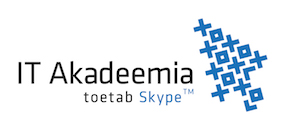

# Eazyfill project snippets

## About

EazyFill extracts payment data from invoices. Startup home page is at [eazyfill.com](http://www.eazyfill.com/) .

## Our process

# Project code snippets

While EazyFill is a commercial project, here are two examples under MIT licencse for getting started with extracting data from PDF files.

* Project *parser-textual* is a small example of extracting sum total from an invoice; it is a Maven project with external dependencies on open-source frameworks;
* Project *positional-order* can be used to train your algorithm in using position to select the most likely value from several candidates for a field;

Link to [project poster](Documentation/poster.pdf)

